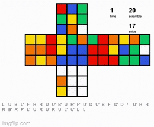
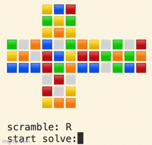

# rubiks_cube
Three Rubik's Cube solvers. Three years.

Rubiks1.0 was my very first Python project.

  

Rubiks2.0 is the fastest of them all.

  

Rubiks3.0 is the most advanced.

<video width="320" height="240" controls>
  <source src="rubiks3.0_demo.mp4" type="video/mp4">
Your browser does not support the video tag.
</video>
