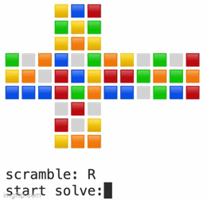
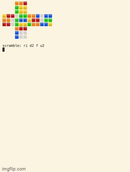

# rubiks_cube
Three Rubik's Cube solvers. Three years.

Rubiks1.0 was my very first Python project.

It executes the Beginner's Method with over 3,000 lines of functions and conditionals.

  

Rubiks2.0 is the fastest of them all.

It executes the Cross-F2L-OLL-PLL Method with Depth First Search using nested for loops.

The code is under 500 lines.

  

Rubiks3.0 is the most advanced.

It executes the Cross-F2L-OLL-PLL Method with Breadth First Search using a queue.

The code is under 350 lines.

  

